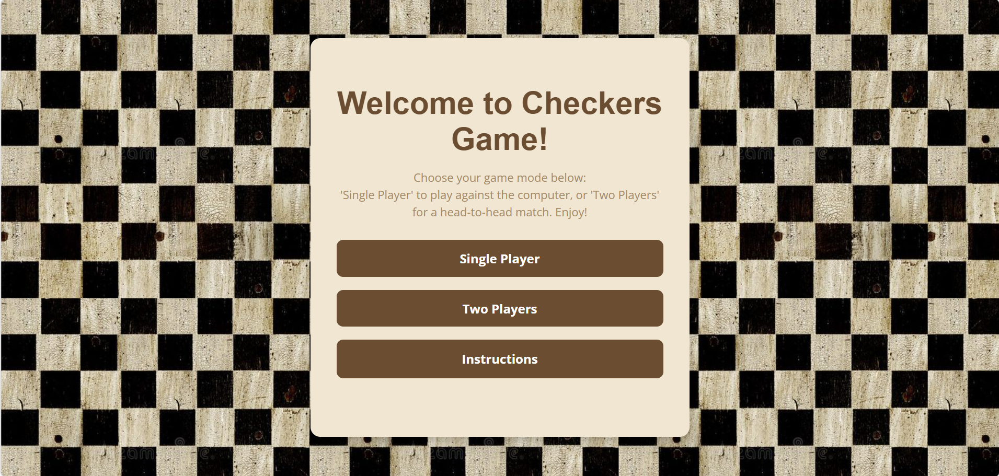
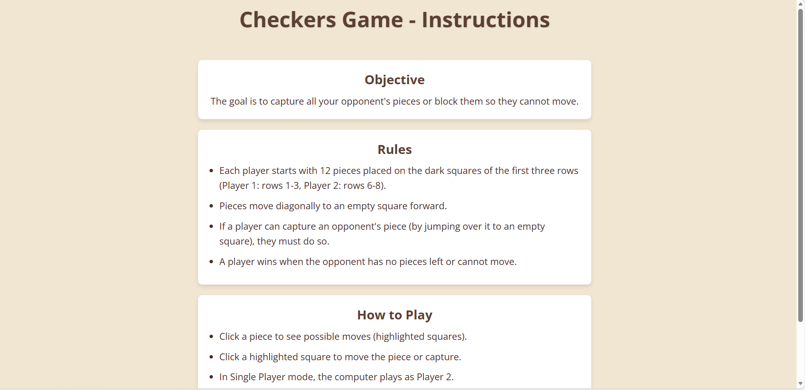

<h1 align="center">Checkers Game</h1>
<h3 align="center">JavaScript Implementation</h3>
<h4 align="center">Final Grade: 100</h4>

<h2>Project Overview</h2>

This project is a fully functional implementation of the classic Checkers (Draughts) board game,
developed using pure JavaScript, HTML, and CSS.

The system was built with emphasis on clean logic design, game state management,
DOM manipulation, and user interaction handling without relying on external frameworks.

The project received a final grade of 100, reflecting high code quality,
correct rule implementation, and structured architecture.

<h2>Core Features</h2>

<ul>
  <li>Full implementation of standard Checkers rules</li>
  <li>Turn-based gameplay</li>
  <li>Mandatory captures enforcement</li>
  <li>Multiple jump support</li>
  <li>King promotion logic</li>
  <li>Win condition detection</li>
  <li>Interactive board rendering</li>
  <li>Dynamic UI updates</li>
</ul>

<h2>Game Rules Implemented</h2>

<ul>
  <li>Diagonal movement</li>
  <li>Forward movement for regular pieces</li>
  <li>Backward movement for kings</li>
  <li>Mandatory capture when available</li>
  <li>Multiple sequential captures</li>
  <li>Automatic king promotion upon reaching last row</li>
  <li>Game ends when a player has no legal moves</li>
</ul>

<h2>Technical Architecture</h2>

<h3>JavaScript Design</h3>

<ul>
  <li>Board represented as a 2D array</li>
  <li>Game state management object</li>
  <li>Move validation functions</li>
  <li>Capture detection algorithm</li>
  <li>Turn management logic</li>
  <li>Dynamic DOM rendering</li>
  <li>Event-driven interaction</li>
</ul>

<h3>State Management</h3>

The board state is maintained in memory and re-rendered after each move.
All rule validation occurs before committing a move to ensure game integrity.

No external libraries or frameworks were used.

<h2>Game Logic Highlights</h2>

<ul>
  <li>Separation between rendering logic and game logic</li>
  <li>Reusable validation functions</li>
  <li>Clear move calculation flow</li>
  <li>Strict rule enforcement</li>
  <li>Efficient board scanning for valid moves</li>
</ul>

<h2>Application Screenshots</h2>

<table align="center">
  <tr>
    <td align="center">
       
      <strong>home</strong>
    </td>
    <td align="center">
       
      <strong>instructions</strong>
    </td>
  </tr>
    <tr>
    <td align="center">
       
      <strong>signle</strong>
    </td>
    <td align="center">
       
      <strong>two-players</strong>
    </td>
  </tr>
</table>

 
>

<h2>How to Run</h2>

<h3>Option 1 – Directly</h3>

Open <strong>index.html</strong> in a browser.

<h3>Option 2 – Local Server</h3>

<pre>
npx serve
</pre>

<h2>Engineering Strengths Demonstrated</h2>

<ul>
  <li>Algorithmic thinking</li>
  <li>Game state modeling</li>
  <li>Complex rule implementation</li>
  <li>Event-driven programming</li>
  <li>Clean and maintainable code structure</li>
  <li>UI synchronization with logic state</li>
</ul>

<h2>Potential Future Improvements</h2>

<ul>
  <li>AI opponent implementation</li>
  <li>Difficulty levels</li>
  <li>Move history tracking</li>
  <li>Undo functionality</li>
  <li>Online multiplayer support</li>
</ul>

Developed by Sara 
Software Engineering Student

